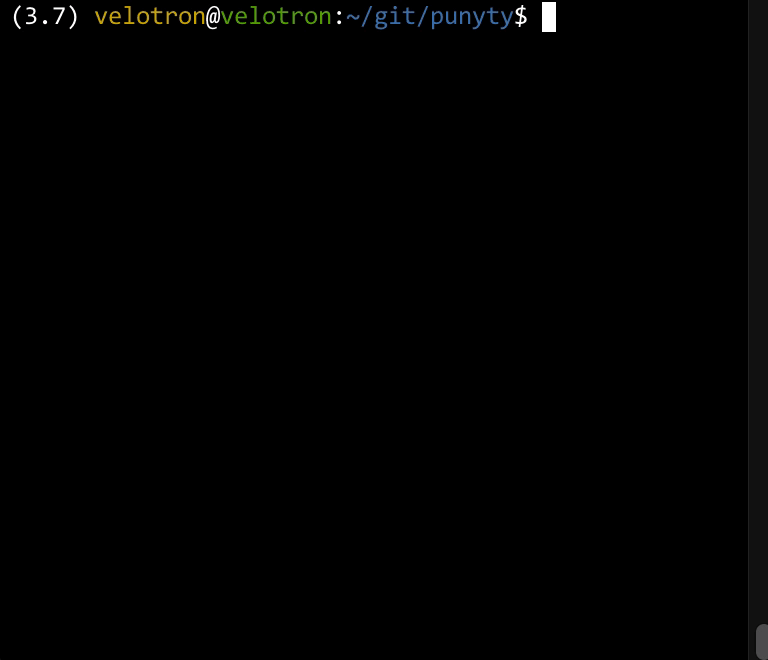

# punyty
Python rendering engine

punyty is a very simple 3D engine born of a need to rotating
draw green wireframe cubes onto numpy arrays. It ships with 3
different renderers:

 - SDLRenderer - renders scene to an SDL window (requires installing extra package punyty[SDL])
 - ArrayRenderer - renders scene to a numpy array
 - TTYRenderer - renders output of ArrayRenderer to ANSI escape codes for TTY display

## Install

```
pip install -e .
```

## Demo

```
python demo/sdl-renderer.py
```

```
punytty
```



