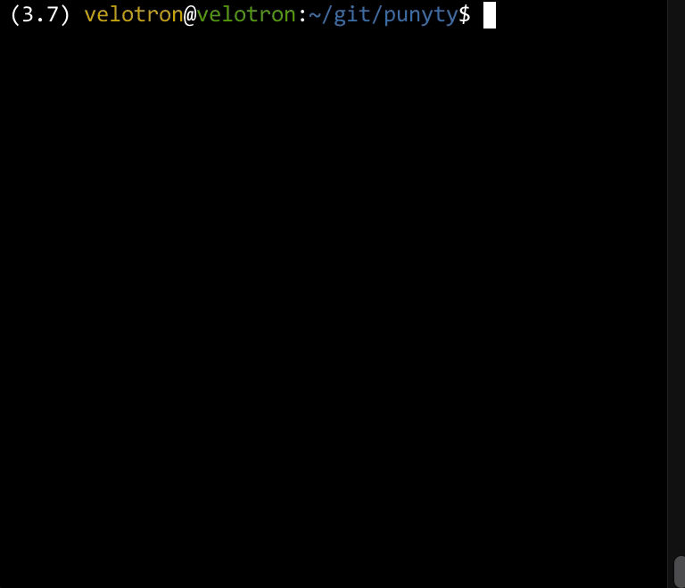

# punyty
Python rendering engine

punyty is a puny 3D engine 
which targets a numpy arrays as a framebuffer. It ships with 3
different renderers:
| ------------- | ------- |
| SDLRenderer   | renders scene to an SDL window (requires installing extra package punyty[SDL]) |
| ArrayRenderer | renders scene to a numpy array |
| TTYRenderer   | renders output of ArrayRenderer to ANSI escape codes for TTY display|

The goal of punyty is to be a minimalist, flexible, and fun way to 
render low resolution 3D scenes.

Polygon winding is left-handed.

## Install

```
pip install -e .
```

## Demo

```
python demo/sdl-renderer.py
```

```
punytty
```



